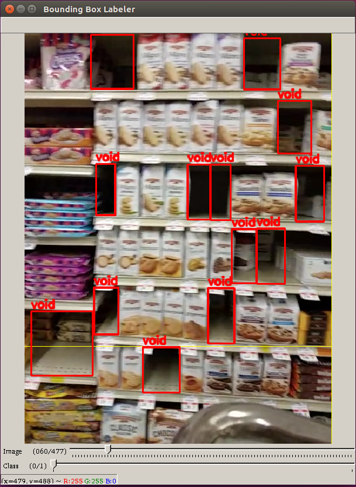

# void-detector

Detect voids in grocery store shelves.

The above are predictions from the first model trained. The images are from the test set.

## Table of Contents
- <a href='#demo'>Demo</a>
- <a href='#visualization'>Visualization</a>
- <a href='#goal'>Goal</a>
- <a href='#log'>Log</a>
    - <a href='#2018-02-15-collect-and-label-data'>2018-02-15: Collect and label data</a>
    - <a href='#2018-02-16-train-model'>2018-02-16: Train model</a>
    - <a href='#2018-02-17-inspect-and-report-results'>2018-02-17: Inspect and report results</a>
    - <a href='#2018-02-18-train-with-voidless-images'>2018-02-18: Train with voidless images</a>
    - <a href='#2018-02-19-understand-the-performance-drop'>2018-02-19: Understand the performance drop</a>
    - <a href='#2018-02-20-clean-the-code'>2018-02-20: Clean the code</a>
    - <a href='#2018-02-21-log-results-in-a-database-part-1'>2018-02-21: Log results in a database (part 1)</a>
    - <a href='#2018-02-22-take-a-break'>2018-02-22: (Take a break)</a>
    - <a href='#2018-02-23-log-results-in-a-database-part-2'>2018-02-23: Log results in a database (part 2)</a>
    - <a href='#2018-02-24-log-results-in-a-database-part-3'>2018-02-24: Log results in a database (part 3)</a>
- <a href='#ambitions'>Ambitions</a>

## Demo

The demo will draw bounding boxes on copies of the given images, similar to the GIF above. The results will be stored in `IMAGE_DIR/void-detector-outputs/`.

### Dockerless

`python demo.py IMAGE_DIR --dockerless`

Requirements:
- [Anaconda 5, Python 3.6 version](https://www.anaconda.com/download/#linux)
- pip install opencv-python
- conda install pytorch torchvision cuda90 -c pytorch
- pip install tqdm

### Docker

`python demo.py IMAGE_DIR`

Requirements:

- [nvidia-docker 2.0](https://github.com/nvidia/nvidia-docker/wiki/Installation-(version-2.0))
- Access to the Docker image
    - Option 1: Obtain read permissions for the Docker image at matthewkleinsmith/void-detector
    - Option 2: Build the image with `docker build -t matthewkleinsmith/void-detector docker/.`

# Visualization

# Goal

- Input: Image of shelf
- Output: Bounding boxes around voids

# Log

## 2018-02-15: Collect and label data

- [x] Collect images of grocery store shelves
    - I walked down the aisles of my local grocery store while recording the shelves
        - 
        - I used a grocery cart to stable my smartphone's camera and to bring the height of the camera close to the height of Focal Systems' camera
        - I used the right lane of each aisle and recorded the shelves of the opposite lane
        - I walked down each aisle twice to record each side
    - The video had dimensions 640 x 480 at 30 fps
    - It took 14 minutes to scan the store
- [x] Label the voids
  - [x] Choose a data format
    - [x] Find and test a pipeline. Use its data format
      - [x] Get a sense of each detection algorithm, choose one, and choose a pipeline for it
        - Detection algorithms: HOG, R-CNN, SPP-net, Fast R-CNN, Faster R-CNN, YOLO, and SSD
      - Initial detection algorithm chosen: SSD: FPNSSD512
      - Pipeline chosen: [torchcv](https://github.com/kuangliu/torchcv/)
      - Data format: lines in train.txt: name.jpg xmin ymin xmax ymax label xmin ymin xmax ymax label ...
  - [x] Choose a bounding box hand-labeling program compatible with the chosen format
    - Labeler chosen: [YOLO v2 Bounding Box Tool](https://github.com/Cartucho/yolo-boundingbox-labeler-GUI)
      - 
    - [My pull requests](https://github.com/Cartucho/yolo-boundingbox-labeler-GUI/pulls?utf8=%E2%9C%93&q=user%3Amattkleinsmith+), and local modifications:
        - [x] Fix TypeError (error was fatal and existed upon git clone)
        - [x] Change output to match the torchcv format
        - [x] Make bounding box colors consistent between labeling sessions
        - [x] Make box form upon mouse-up, instead of requiring two clicks
        - [x] Add filename to help screen to make debugging easier
        - [x] Add the option to display the images in order
        - [x] Start session at first unlabeled image
        - [ ] Allow the user to start with the bottom right corner
        - [ ] Allow the user to adjust the line width
  - [x] Convert videos to images
    - [x] Consider minimizing the overlap of images to reduce the cost of labeling
      - [x] Choose a good sampling rate
        - [x] Choose fastest sampling rate, get a sense of the overlap, and choose a slower sampling rate
        - [x] Consider using an algorithm that detects image overlap, like those used in panorama creators
          - Unneeded. Manual inspection worked.
        - Sampling rate chosen: 1 fps.
        - I preserved the frame IDs with respect to 30 fps to ease the use of object detection later.
  - [x] Consider which kinds of voids to label for the prototype:
    - [Yes] Complete void
    - [Yes] Void with product behind it
    - [Not yet] Void with product in front of it

## 2018-02-16: Train model
- [x] Make the data, model, and training pipeline compatible
    - [x] Convert labels to correct format
      - The VOC PASCAL format defines the top-left corner as (1, 1), not (0, 0). I'll need to add one to each coordinate in my labels, and change the labeler program for future labeling.
        - [x] Add one to each coordinate
        - [x] Fix labeler
      - [x] The labeler program, reasonably, stores bounding box information of name.jpg in name.txt, with each bounding box on a separate line. I'll need to convert this to torchcv format, where all the bounding boxes for a single image are on one line.
      - [x] I need to append the video timestamp to label names to avoid name conflicts.
    - [x] Customize model, and modify training pipeline accordingly
        - [My fork of torchcv](torchcv):
            - [x] Change the number of classes from 21 to 2
            - [x] Reset the conv layers in the classifiers and locators
            - Leave the base model weights alone
- [x] Train model
    - Configuration:
        - Epochs: 200
        - Image size: 512x512
            - Resized with PIL, nearest neighbor
        - Batch size: 16
        - Learning rate: 1e-4
        - Loss: [SSD loss](https://github.com/kuangliu/torchcv/blob/master/torchcv/loss/ssd_loss.py)
        - Optimizer: SGD
            - Momentum: 0.9
            - Weight decay: 1e-4
        - Duration: 1 hour, 10 minutes
            - GPU: Titan X Pascal
    - Dataset
        - 329 images with ground truth voids
        - 1062 ground truth voids (void-img ratio: 3.22)
        - Images from one set of sides (black side of route diagram)
        - I didn't include images without voids
            - I'll handle this case the next time I train

## 2018-02-17: Inspect and report results
- [x] Inspect results
    - [x] Visually
        - [x] Look at test set predictions
    - [x] Quantitatively
        - [x] Label data for the test set
            - 80 images with ground truth voids
            - 385 ground truth voids (void-img ratio: 4.81)
            - Images from one set of sides (blue side of route diagram)
        - [x] Calculate average precision (IoU threshold: 0.5)
            - 0.5 is the [PASCAL VOC standard](http://homepages.inf.ed.ac.uk/ckiw/postscript/ijcv_voc09.pdf). CTRL+F: "Bounding box evaluation"
- [x] Report results
    - [x] Visually
        - [x] Create GIF of test set predictions
    - [x] Quantitatively: Average precision
        - **Train: 0.9091** (N: 329)
        - **Test: 0.1672** (N: 80)
        - **These results imply extreme overfitting, but the visual results show decent performance**.
            - 
            - The predictions are in red and the ground truth is in green.
            - The model detected some voids I missed.
            - When labeling the test set, I tended to cut large voids into smaller voids with sizes equal to the sizes of nearby products. I didn't do this as often when labeling the training set. This difference in ground truth is likely responsible for a large loss in precision. If so, this shows the importance of documenting changes in the labeling procedure, and shows a benefit of standarizing the labeling procedure.

## 2018-02-18: Train with voidless images
- [x] Figure out how to train with voidless images
    - [x] Consider adding "name.jpg" to the label list, as opposed to "name.jpg xmin ymin xmax ymax class"
        - Rejected: The pipeline doesn't know how to handle empty cases
    - [x] Consider adding "name.jpg 1 1 height+1 width+1 1", where 1 is the voidless class
        - Rejected: This will disable hard negative mining, skewing the model toward voidlessness. A model could get a good score by labeling all regions as voidless
    - [x] Consider adding "name.jpg 1 1 height+1 width+1 -1", where -1 is the voidless class
        - Accepted: This will ensure voidless regions are considered negative examples in hard negative mining
    - [x] Hard negative mining returns nothing when there are no positive examples. Figure out what to do.
        - If there are no positive examples, I'll return five negative examples. Let this be a hyperparameter.
            - Warning: This hyperparameter seems more dangerous than usual with respect to overfitting. I'll likely leave it at five instead of tuning it.
- [x] Train with voidless images (output: Model 2)
- [x] Inspect and report results
    - Average precision:
        - Train: **0.6276** (N: 476) (1st model: 0.9041))
        - Test: **0.1541** (N: 100) (1st model: 0.1604))
    - Model 2 slowed the system down significantly.
        - Model 1 took 10 seconds to evaluate on the training set. Model 2 took 27 minutes.
            - Model 2 outputted 100 times more location predictions than Model 1, which is the default behavior of the architecture; i.e., Model 2 is far closer to random than Model 1.
    - I expected Model 2 to outperform Model 1, because I gave it more information. In particular, I expected Model 2 to have fewer false positives than Model 1, but potentially fewer true positives, too. Is there a bug in my code, or are the voidless images derailing the training process?

## 2018-02-19: Understand the performance drop
- [ ] Study the pipeline
    - [x] List Dataset
    - [x] Data augmentations
    - [x] SSD encoder
    - [ ] FPNSSD512
    - [x] SSD loss
        - [x] Location loss
        - [x] Hard negative mining
        - [x] Class loss
        - My custom loss function is returning giant and NaN losses.
    - [x] SSD decoder
    - [x] Evaluator
    - [ ] Visualize each
- [ ] Train on the first dataset to test code changes

## 2018-02-20: Clean the code
- [x] Train on the first dataset to test code changes
    - Model 1 performed poorly when trained with the new code
- [x] Debug
    - [x] Explain Model 1's precision drop
        - Fact: The training data is the same.
        - Fact: The code is not the same.
        - Fact: New: The saver stopped saving by epoch 20.
        - Fact: The saver saves based on the validation data.
        - Fact: The validation data is not the same.
        - Hypothesis: The difference in validation data is responsible for the drop in precision.
        - [x] Test hypothesis
            - [x] Test with Model 1
                - Result: Train: 0.9091 (N: 329): Hypothesis confirmed
- [x] Merge void-detector repo with void-torchcv repo
- [x] Retrain Model 2
    - Result: **0.9044** (N: 476) (**during bug: 0.6276**) (1st model: 0.9041))
    - I expected more than 0.03% improvement w.r.t. Model 1 (and it might just be noise), but at least the bug is gone. Later I'll train the models until convergence with the current hyperparameter configuration, and afterward start tuning the hyperparameters.
- [x] Dockerize
    - [Automated build](https://hub.docker.com/r/matthewkleinsmith/void-detector/)

## 2018-02-21: Log results in a database (part 1)
- I'm starting with sqlite3. I'll add PostgreSQL as an option later to better handle multi-machine logging.
- [x] Clean code a little more
    - [x] Preserve original image shape in the demo
    - [x] Allow non-Docker in the demo
    - [x] Add GPU selection to the demo
- [x] Improve torchcv's logging
    - [x] Add ETA and duration
    - [x] Remove unneeded messages
    - [x] Make checkpoint filenames more descriptive
        - [x] Add git hash
        - [x] Add training configuration description
- [x] Add tests: `pytest tests`
- [x] Add basic sqlite commands

## 2018-02-22: (Take a break)

## 2018-02-23: Log results in a database (part 2)
- [x] Clean up after code tests
    - [x] Delete checkpoints
    - [x] Delete drawings
- [ ] Store the following:
    - [x] Training configuration information
    - [ ] Final results
    - [x] Epoch-by-epoch results
    - Bonus:
        - [ ] The evolution of void boxes on one or two images
        - [ ] The evolution of non-void boxes on one or two images

## 2018-02-24: Log results in a database (part 3)
- [x] Store the following:
    - [x] Final results
    - [x] num_trn, num_val, trn_name, val_name, gpu_name, arch, loss_fn, optimizer, momentum, weight_decay, voidless_included
    - [x] x_min, y_min, x_max, y_max for a pre-selected image
- [x] Draw the evolution of the predictions on a pre-selected image: draw_box_evolution.py
- [x] Create a GIF to visualize

# Ambitions

Real-time processing on embedded device:
- Same input-output relationship
- Constraint: 30 fps
- Constraint: Smartphone

Void categorization:
- Input: Image of shelf
- Output: Product IDs of voids
- An approach: Use void localization with planograms:
    - 

Void localization:
- Input: Image of shelf
- Output: xyz-coordinates of voids, with respect to a 3D store map
- Visualization: Discrete low-resolution bird's-eye view heatmap
  - e.g. split store into N sections and color each section by number of voids
    - e.g. N == num_aisles * num_sections_per_aisle + num_non_aisle_sections
- Thoughts: The z-coordinate is easiest. The x-y coordinates will require more work.
    -  [SLAM](https://en.wikipedia.org/wiki/Simultaneous_localization_and_mapping). Can it work with just images?
    - Non-SLAM options:
        - GPS. This might not be reliable enough. It would add to hardware costs, too.
        - Count grocery cart wheel rotations and measure wheel angles. This would add to hardware and maintenance costs
        - Other non-GPS distance measurers

Efficient hand-labeling:
- Label a void in one frame, then use an object tracker to label the void for the rest of the frames. This would multiply the number of labels by about 30, assuming a 30 FPS camera and a void-on-screen-time of one second.
