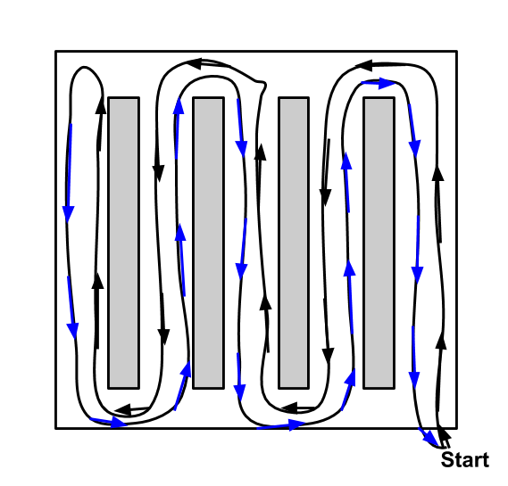
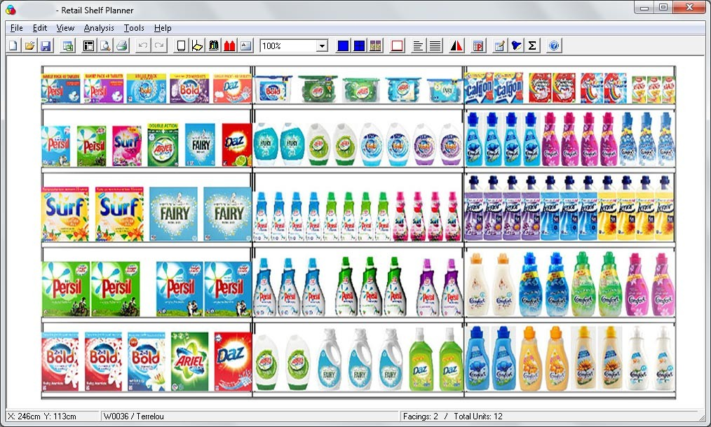

# void-detector

Detect voids in grocery store shelves.

The above are predictions from the first model trained. The images are from the test set.

## Table of Contents
- <a href='#goal'>Goal</a>
- <a href='#log'>Log</a>
    - <a href='#2018-02-15-collect-and-label-data'>2018-02-15: Collect and label data</a>
    - <a href='#2018-02-16-train-model'>2018-02-16: Train model</a>
    - <a href='#2018-02-17-inspect-and-report-results'>2018-02-17: Inspect and report results</a>
- <a href='#ambitions'>Ambitions</a>

# Goal

- Input: Image of shelf
- Output: Bounding boxes around voids

# Log

## 2018-02-15: Collect and label data

- [x] Collect images of grocery store shelves
    - I walked down the aisles of my local grocery store while recording the shelves
        - 
        - I used a grocery cart to stable my smartphone's camera and to bring the height of the camera close to the height of Focal Systems' camera
        - I used the right lane of each aisle and recorded the shelves of the opposite lane
        - I walked down each aisle twice to record each side
    - The video had dimensions 640 x 480 at 30 fps
    - It took 14 minutes to scan the store
- [x] Label the voids
  - [x] Choose a data format
    - [x] Find and test a pipeline. Use its data format
      - [x] Get a sense of each detection algorithm, choose one, and choose a pipeline for it
        - Detection algorithms: HOG, R-CNN, SPP-net, Fast R-CNN, Faster R-CNN, YOLO, and SSD
      - Initial detection algorithm chosen: SSD: FPNSSD512
      - Pipeline chosen: [torchcv](https://github.com/kuangliu/torchcv/)
      - Data format: lines in train.txt: name.jpg xmin ymin xmax ymax label xmin ymin xmax ymax label ...
  - [x] Choose a bounding box hand-labeling program compatible with the chosen format
    - Labeler chosen: [YOLO v2 Bounding Box Tool](https://github.com/Cartucho/yolo-boundingbox-labeler-GUI)
      - 
    - [My fork](https://github.com/MattKleinsmith/yolo-boundingbox-labeler-GUI/tree/patch-2)
        - [x] Change output to match the torchcv format
        - [x] Make bounding box colors consistent between labeling sessions
        - [x] Make box form upon mouse-up, instead of requiring two clicks
        - [x] Add filename to help screen to make debugging easier
        - [x] Add the option to display the images in order
        - [x] Start session at first unlabeled image
        - [ ] Allow the user to start with the bottom right corner
        - [ ] Allow the user to adjust the line width
  - [x] Convert videos to images
    - [x] Consider minimizing the overlap of images to reduce the cost of labeling
      - [x] Choose a good sampling rate
        - [x] Choose fastest sampling rate, get a sense of the overlap, and choose a slower sampling rate
        - [x] Consider using an algorithm that detects image overlap, like those used in panorama creators
          - Unneeded. Manual inspection worked.
        - Sampling rate chosen: 1 fps.
        - I preserved the frame IDs with respect to 30 fps to ease the use of object detection later.
  - [x] Consider which kinds of voids to label for the prototype:
    - [Yes] Complete void
    - [Yes] Void with product behind it
    - [Not yet] Void with product in front of it
- [ ] Create train, validation, and test sets
  - Consider splitting by aisle
  - Consider splitting by store
    - If so, collect data from two more stores
- [ ] Resize data for model input
  - Consider downsampling or cropping
- [ ] Redefine model as needed
- [ ] Train, tune HPs, test

## 2018-02-16: Train model
- [x] Make the data, model, and training pipeline compatible
    - [x] Convert labels to correct format
      - The VOC PASCAL format defines the top-left corner as (1, 1), not (0, 0). I'll need to add one to each coordinate in my labels, and change the labeler program for future labeling.
        - [x] Add one to each coordinate
        - [x] Fix labeler
      - [x] The labeler program, reasonably, stores bounding box information of name.jpg in name.txt, with each bounding box on a separate line. I'll need to convert this to torchcv format, where all the bounding boxes for a single image are on one line.
      - [x] I need to append the video timestamp to label names to avoid name conflicts.
    - [x] Customize model, and modify training pipeline accordingly
        - [My fork of torchcv](https://github.com/MattKleinsmith/void-torchcv):
            - [x] Change the number of classes from 21 to 2
            - [x] Reset the conv layers in the classifiers and locators
            - Leave the base model weights alone
- [x] Train model
    - Configuration:
        - Epochs: 200
        - Image size: 512x512
            - Resized with PIL, nearest neighbor
        - Batch size: 16
        - Learning rate: 1e-4
        - Loss: [SSD loss](https://github.com/kuangliu/torchcv/blob/master/torchcv/loss/ssd_loss.py)
        - Optimizer: SGD
            - Momentum: 0.9
            - Weight decay: 1e-4
        - Duration: 1 hour, 10 minutes
            - GPU: Titan X Pascal
    - Dataset
        - 329 images with ground truth voids
        - 1062 ground truth voids (void-img ratio: 3.22)
        - Images from one set of sides (black side of route diagram)
        - I didn't include images without voids
            - I'll handle this case the next time I train

## 2018-02-17: Inspect and report results
- [x] Inspect results
    - [x] Visually
        - [x] Look at test set predictions
    - [x] Quantitatively
        - [x] Label data for the test set
            - 80 images with ground truth voids
            - 385 ground truth voids (void-img ratio: 4.81)
            - Images from one set of sides (blue side of route diagram)
        - [x] Calculate average precision (IoU threshold: 0.5)
            - 0.5 is the [PASCAL VOC standard](http://homepages.inf.ed.ac.uk/ckiw/postscript/ijcv_voc09.pdf). CTRL+F: "Bounding box evaluation"
- [x] Report results
    - [x] Visually
        - [x] Create GIF of test set predictions
    - [x] Quantitatively: Average precision
        - **Train: 0.9091** (N: 329)
        - **Test: 0.1672** (N: 80)
        - **This shows extreme overfitting, but it disagrees with the visual results**.
            - I think I changed the way I labeled the test set, which shows the importance of standardizing the labeling process, or at least labeling in one session.
                - How I changed my labeling style: If there was a large void next to small objects, I cut the voids into pieces with sizes equal to the size of the small objects.
- [ ] Improve torchcv's logging
    - [ ] Add ETA and duration
    - [ ] Remove unneeded messages
    - [ ] Make checkpoint filenames more descriptive
        - [ ] Add git hash
        - [ ] Add training configuration description

# Ambitions

Real-time processing on embedded device:
- Same input-output relationship
- Constraint: 30 fps
- Constraint: Smartphone

Void categorization:
- Input: Image of shelf
- Output: Product IDs of voids
- An approach: Use void localization with planograms:
    - 

Void localization:
- Input: Image of shelf
- Output: xyz-coordinates of voids, with respect to a 3D store map
- Visualization: Discrete low-resolution bird's-eye view heatmap
  - e.g. split store into N sections and color each section by number of voids
    - e.g. N == num_aisles * num_sections_per_aisle + num_non_aisle_sections
- Thoughts: The z-coordinate is easiest. The x-y coordinates will require more work.
    -  [SLAM](https://en.wikipedia.org/wiki/Simultaneous_localization_and_mapping). Can it work with just images?
    - Non-SLAM options:
        - GPS. This might not be reliable enough. It would add to hardware costs, too.
        - Count grocery cart wheel rotations and measure wheel angles. This would add to hardware and maintenance costs
        - Other non-GPS distance measurers

Efficient hand-labeling:
- Label a void in one frame, then use an object tracker to label the void for the rest of the frames. This would multiply the number of labels by about 30, assuming a 30 FPS camera and a void-on-screen-time of one second.
